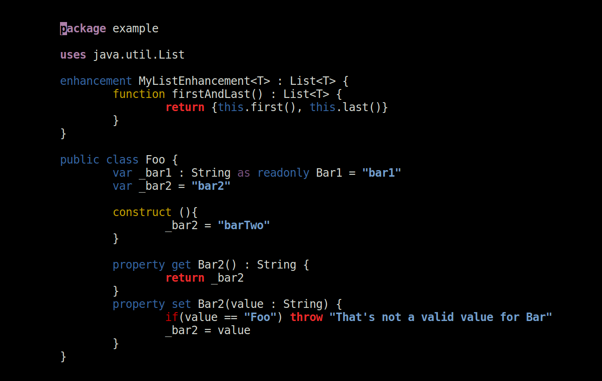
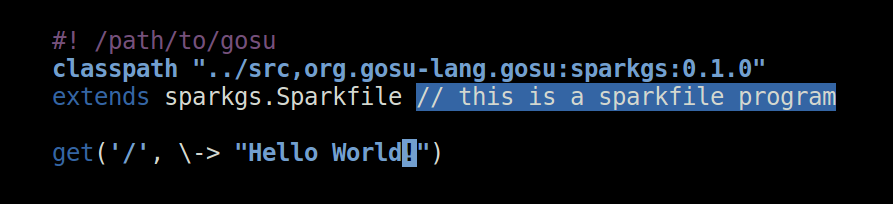
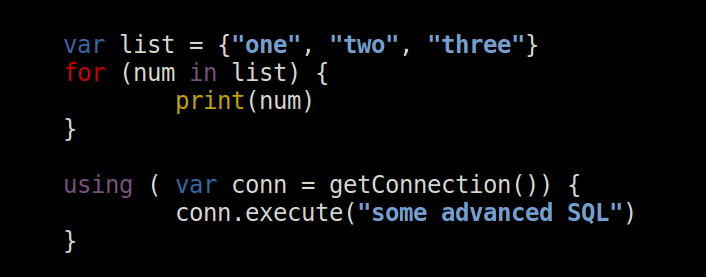
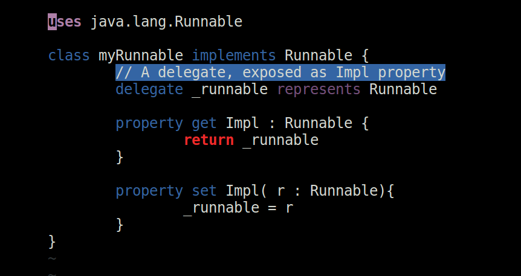

# vim-gosu
Syntax highlighting for gosu-lang based off of vim's own Java syntax highlighting.

Some example images:

## Color schemes
Color schemes which use a lot of different colors for different types of keywords are preferable. I would ecommended 'yeller' from github.com/flazz/vim-colorschemes, which is used in the above images.

## Possible Expansions
* Debugging
* Compiling

---
*Contributions welcome*
